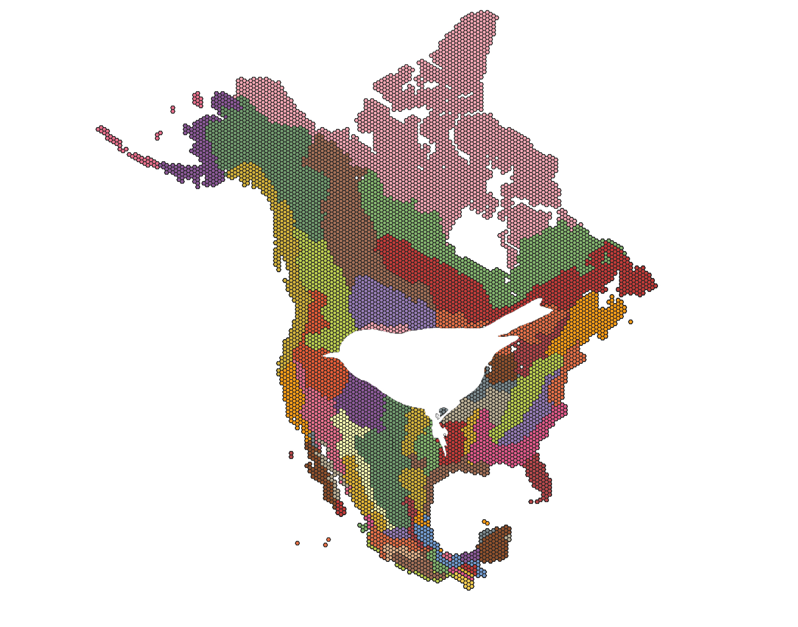

<!-- PROJECT LOGO -->

<br />
<p align="center">
  <a href="https://github.com/jessealaney/North_America_Passerine_Diversity_Dimensionality">
    
  </a>

  <h3 align="center">North American Passerine Diversity Dimensionality</h3>

  <p align="center">
    Project exploring the dimensionality (covariation of multiple dimensions of biodiversity) across passerines within North American bird conservation regions
    <br />
    <a href="https://github.com/jessealaney/North_America_Passerine_Diversity_Dimensionality"><strong>Explore the docs »</strong></a>
    <br />
    <br />
    <a href="https://github.com/jessealaney/North_America_Passerine_Diversity_Dimensionality">View Demo</a>
    ·
    <a href="https://github.com/jessealaney/North_America_Passerine_Diversity_Dimensionality/issues">Report Bug</a>
    ·
    <a href="https://github.com/jessealaney/North_America_Passerine_Diversity_Dimensionality/issues">Request Feature</a>
  </p>
</p>


<!-- TABLE OF CONTENTS -->
## Table of Contents

* [About the Project](#about-the-project)
  * [Built With](#built-with)
* [Getting Started](#getting-started)
  * [Installation](#installation)
* [Roadmap](#roadmap)
* [Contact](#contact)
* [Acknowledgements](#acknowledgements)


<!-- ABOUT THE PROJECT -->
## About The Project

This is a project exploring the dimensionality (covariation of multiple dimensions of biodiversity) across passerines within North American bird conservation regions.

This project is currently under construction!

### Built With

* [R Studio](https://rstudio.com/)


<!-- GETTING STARTED -->
## Getting Started

To get a local copy up and running follow these simple steps.

### Installation

1. Clone the repo
```sh
git clone https://github.com/jessealaney/North_America_Passerine_Diversity_Dimensionality.git
```
2. Install R packages
```sh
install.packages("pacman") 
pacman::p_load(ape, phytools, plyr, picante, treescape, janitor, vegan, pez, FD, classInt, tibble,phyloregion, data.table, tools, tidyr, dplyr)
```
3. Run the master script
```sh
scripts/NA_passerines_dimensionality.R
```

<!-- ROADMAP -->
## Roadmap

See the [open issues](https://github.com/jessealaney/North_America_Passerine_Diversity_Dimensionality/issues) for a list of proposed features (and known issues).

<!-- CONTACT -->
## Contact

Jesse A. Laney - laneyj@oregonstate.edu

Project Link: [https://github.com/jessealaney/North_America_Passerine_Diversity_Dimensionality](https://github.com/jessealaney/North_America_Passerine_Diversity_Dimensionality)


<!-- ACKNOWLEDGEMENTS -->
## Acknowledgements

* [Analytical Workflows](https://github.com/analyticalworkflows)
